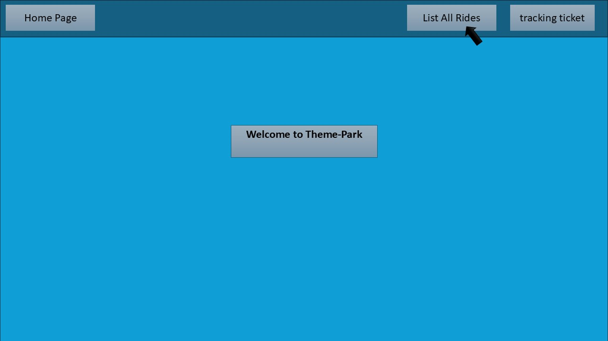
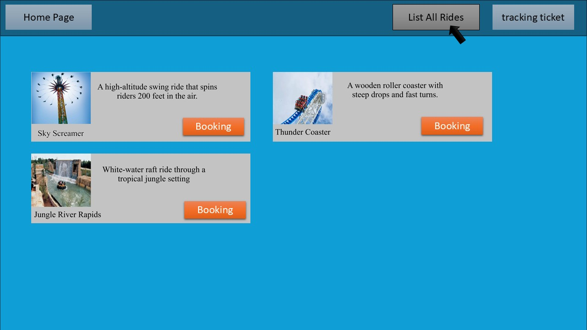
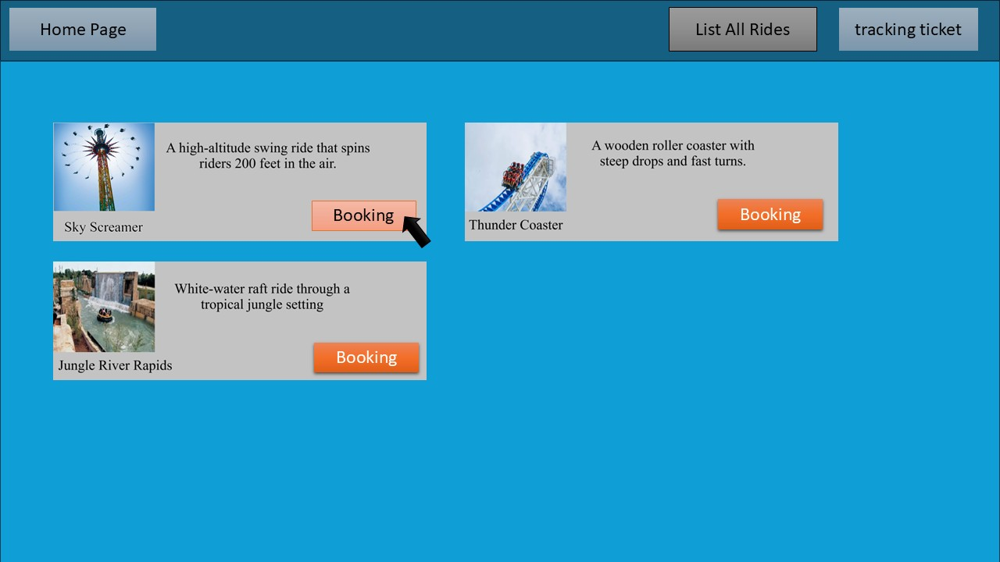
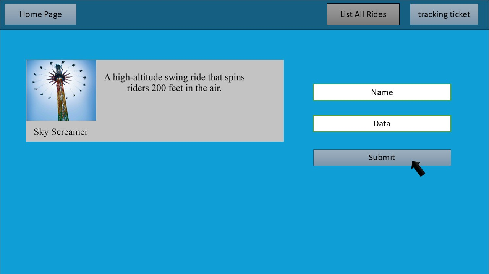
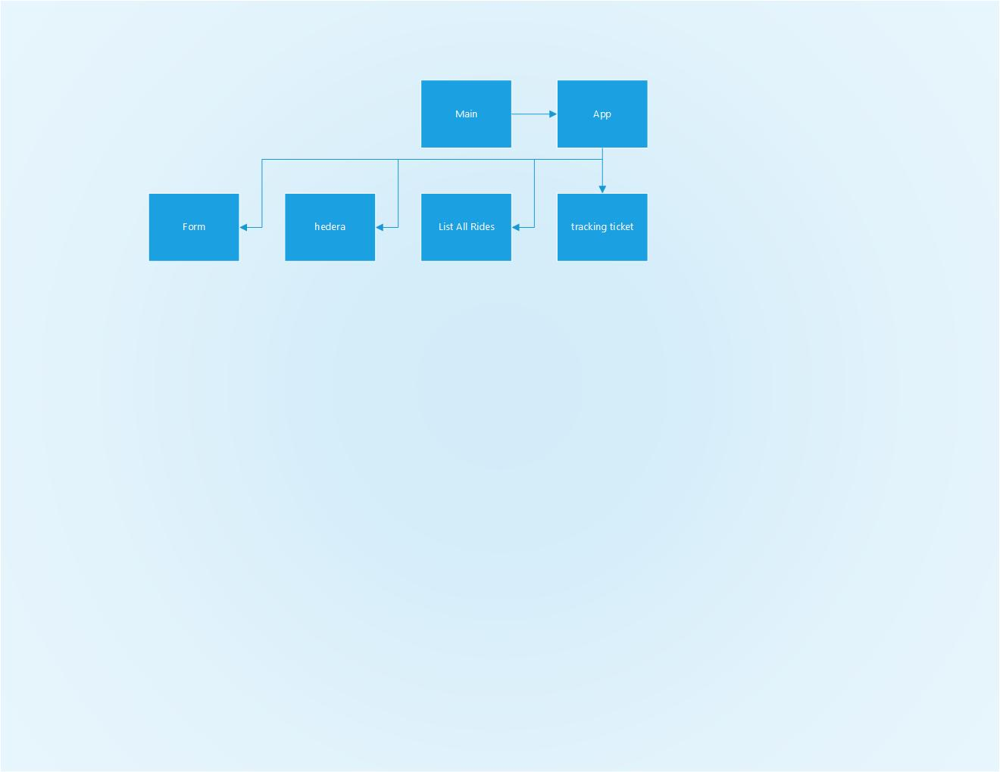

# Booking Ticket-Park

# Date 8/04/2025

# By: Mahmood Ali, Zeshan Ahmed , Abdulla Zaid

# A brief Description of Project

A back-end Design for website users can view all ride games and book a ticket for a ride

# Wireframes Design

Home Page

Lisi All rides

select one ride

book one ride

# ERD Design

# RESTful Table

# Component Hierarchy Diagrams

# Screenshot Design

# Lists/Tech used

- html
- JavaScript
- express
- mongodb-mongoose

# Future work

- .

# source /reference/attributions

- 
